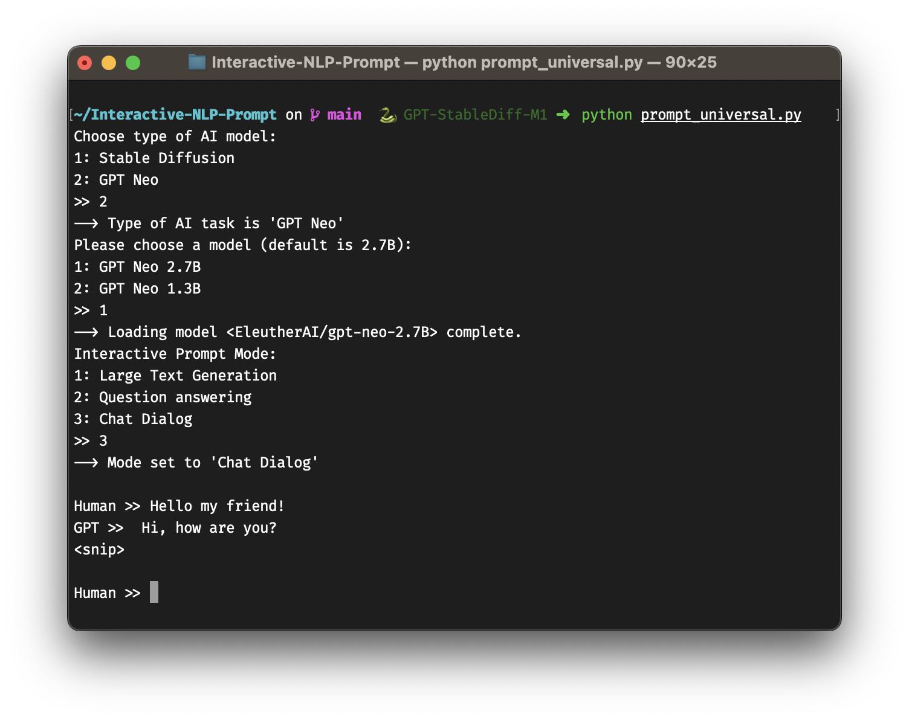

# Interactive-NLP-Prompt
A simple CLI prompt tool for GPT and Stable Diffusion models based on the Hugging Face Hub libraries (https://huggingface.co/docs/hub/models-libraries).

The python library requirements are based on an installation on a Apple M1 Pro MacBook.



## Installation
Install the mandatory python packages and their dependencies:
- huggingface_hub
- transformers
- diffusers
- accelerate
- torch, torchvision, torchaudio
- numpy
- opencv-python

## Usage
Start the script by 
```bash
python prompt_universal.py
```

General: type quit into the prompt and hit return to exit the application.

### Startup options

1. Stable Diffusion
2. GPT Neo

If you choose

1. -> You will be asked which Stable Diffusion Model should be loaded: 1.5 or 2.1 (I recommend 2.1 if you have enough RAM)
2. You will be asked which GPT Neo model size should be loaded: 2.7B or 1.3B

### Stable Diffusion Options
Options in the running prompt:
- change the number of inference steps without restarting: infSteps=25 to change it to 25 for example.

### GPT Options
1. Large Text Generation, parameters initialized with: max_new_tokens=150, temperature=0.6, do_sample=True, top_p=1, repetition_penalty=10, pad_token_id=tokenizer.eos_token_id, eos_token_id=21017

2. Question answering, parameters initialized with: max_new_tokens=50, temperature=0.03, do_sample=False, num_beams=1, repetition_penalty=10.0,
 early_stopping=True, pad_token_id=tokenizer.eos_token_id, eos_token_id=21017

3. Chat Dialog (a ChatGPT-like chat prompt), parameters initialized with: max_new_tokens=12, temperature=0.3, do_sample=True, top_p=0.5, repetition_penalty=20.0, pad_token_id=tokenizer.eos_token_id, eos_token_id=21017

Options in the running prompt:
- changeMode: Opens menu to switch to prompt mode 1, 2 or 3
- setLength="number": Set the number of maximum new tokens to limit the output of GPT
- reset: (Only for Chat mode) Discards all previous inputs/outputs of the dialog
- showHistory: Display complete prompt history
- dump: Write the entire prompt history to a text file in the result_cache folder


